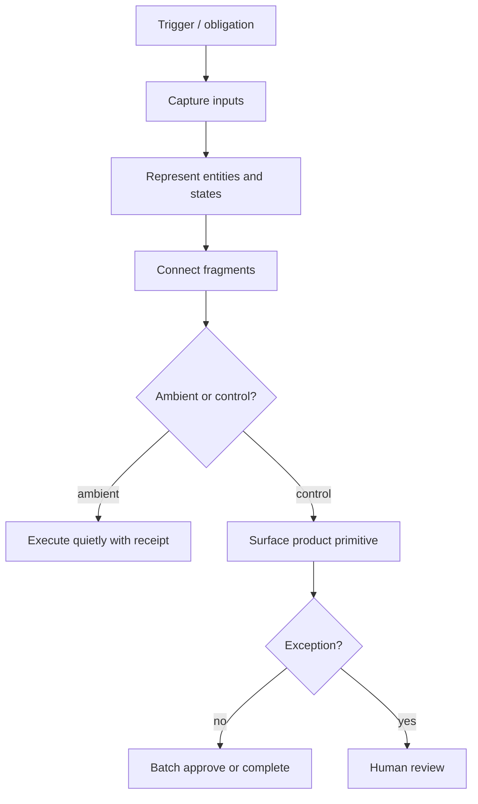

# Workflow Trellis

Use this skill to turn messy workflow evidence into a clear representation of how the work actually functions, what obligation forces it to exist, where the representation is fragmented, and where AI can be inserted safely.

The central thesis: do not start with "AI can automate X." Start by representing the work. Once the obligation, entities, states, deadlines, dependencies, evidence, fragments, and human judgment points are visible, the AI opportunities become obvious and less hand-wavy.

The output should make the workflow visible as an object. Tables are not decoration here; they force the analysis to separate the parts of the work that get blurred in prose. Every deep workflow model must include the required tables, a workflow diagram, an `Intuition Gained` section, and a `Product Implications` section.

## When Starting

If the user provides interviews, transcripts, notes, support tickets, customer research, or a domain description, treat that material as evidence. Extract workflows from it rather than brainstorming from scratch.

Ask at most three clarifying questions only when the answer materially changes the representation:

1. Which workflow or user segment should be modeled first?
2. Is the goal product strategy, AI feature design, customer discovery, or startup exploration?
3. Should the output favor breadth across many workflows or depth on one workflow?

If the user sounds like they want momentum, skip questions and state assumptions.

## Core Lens

Analyze workflows through three gates:

1. **Durable obligation**: The work must exist because law, money, customers, operations, professional standards, auditability, or accountability demand it.
2. **Fragmented representation**: The truth of the work must be split across spreadsheets, emails, PDFs, bank portals, desktop apps, messages, forms, humans, vendors, customers, or legacy systems.
3. **Hated execution burden**: The recurring work must be tedious, anxiety-producing, deadline-bound, error-prone, or socially annoying enough that users already complain about it.

Do not discard weak workflows immediately. Label them:

- **Strong workflow candidate**: all three gates are present.
- **Partial workflow candidate**: one gate is weak or unclear.
- **Weak candidate**: the pain is optional, one-off, or mostly high-judgment with no repeatable representation.

## Workflow Model Layers

For every important workflow, map the building blocks through these layers.

### Layer 1: Capture the obligation

Ask:

- What must exist because law, money, customers, operations, or accountability demand it?
- Who is accountable if it is late, wrong, missing, or unreconciled?
- What external event forces the work to happen repeatedly?

Look for filings, payments, reconciliations, reports, renewals, certifications, approvals, customer commitments, safety checks, billing events, audits, handoffs, inspections, and status updates.

Output the obligation as a concise statement:

```markdown
[Actor] must [produce/verify/decide/submit/reconcile/respond] [artifact/outcome] by [deadline/trigger] because [external force/consequence].
```

### Layer 2: Represent the workflow

Ask:

- What entities define the work?
- What states can each entity move through?
- What deadlines, dependencies, permissions, and evidence are required?
- What does "done correctly" mean?

Represent the workflow before proposing AI. This layer is the workbench for intuition.

Use this structure:

- **Actors**: people or organizations involved.
- **Entities**: customers, accounts, documents, tasks, risks, decisions, vendors, claims, cases, assets.
- **States**: draft, waiting, submitted, blocked, approved, rejected, reconciled, expired, escalated.
- **Transitions**: events or actions that move entities between states.
- **Deadlines**: explicit dates, SLAs, renewal cycles, meeting dates, billing cutoffs, regulatory windows.
- **Permissions**: who can view, edit, approve, submit, override, or be accountable.
- **Dependencies**: inputs, approvals, evidence, data feeds, other teams, external portals.
- **Evidence**: documents, messages, logs, signatures, receipts, metrics, screenshots, decisions.
- **Definition of done**: what proves the workflow is complete and acceptable.

### Layer 3: Connect the fragments

Ask:

- Where does the truth currently live?
- Which systems do users manually compare, copy from, or reconcile?
- Which humans act as routers between fragmented tools?

Common fragments: spreadsheets, inboxes, PDFs, portals, accounting systems, CRMs, ERPs, bank feeds, desktop software, government sites, customer forms, SMS/WhatsApp, vendors, accountants, field workers, and shared drives.

Create a fragment map. This table is required for every deep workflow model because it shows where the current representation is broken:

```markdown
| Fragment | Contains | Owner | Update frequency | Failure mode |
|---|---|---|---|---|
```

### Layer 3.5: Identify the action kernel and friction kernel

Before proposing automation, decompose each workflow step into the human action it contains.

Do not jump from "workflow step" to "AI mechanism." First ask:

- What type of action is the human performing?
- Which part of that action creates friction?
- What information, evidence, confidence, language, timing, or authority would let them move forward?
- Which part can be prepared by software without taking over accountability?
- Which part must remain visible because it carries judgment, relationship risk, legitimacy, or responsibility?

Use these action kernels:

- **Find**: locate the relevant record, message, document, person, or prior example.
- **Extract**: pull structured facts from messy input.
- **Compare**: reconcile two representations of the same truth.
- **Classify**: assign type, status, owner, priority, risk, or account code.
- **Decide**: choose whether to proceed, hold, escalate, approve, reject, or defer.
- **Compose**: write language, an email, a memo, a note, a checklist, or an explanation.
- **Chase**: request missing input, payment, evidence, approval, or clarification.
- **Monitor**: track time, deadline risk, stale work, status, or drift.
- **Approve**: take responsibility for a proposed action or outcome.
- **Repair**: resolve an exception, conflict, relationship issue, or incorrect state.

Then identify the friction kernel:

- **Search friction**: finding the right thing.
- **Context assembly friction**: gathering enough surrounding facts.
- **Mapping friction**: connecting one representation to another.
- **Uncertainty friction**: knowing whether the answer is safe enough.
- **Evidence friction**: knowing whether proof is sufficient.
- **Blank-page friction**: deciding what to write or say.
- **Social friction**: saying it with the right tone or relationship posture.
- **Memory friction**: remembering to act at the right time.
- **Attention friction**: deciding what deserves interruption.
- **Legitimacy friction**: making the decision acceptable to others.
- **Accountability friction**: being able to explain who decided and why.

For each meaningful step, produce an action kernel table:

```markdown
| Step | Human action kernel | Friction kernel | Missing ingredient | What software can prepare | What must stay human |
|---|---|---|---|---|---|
```

### Layer 3.6: Split ambient absorption from control surface

Classify each workflow step by whether it should disappear into the background or remain surfaced for control.

Do not assume every automation needs a visible UI. Some work should be absorbed quietly. But do not hide work that carries uncertainty, consequence, authority, relationship risk, legitimacy, or audit requirements.

Classify each step:

- **Ambient absorption**: system executes quietly; user only sees summary or audit trail.
- **Ambient with receipt**: system executes quietly but leaves a visible record.
- **Batch control**: many low-risk actions grouped for quick approval.
- **Exception control**: only uncertain, blocked, or high-consequence items surfaced.
- **Human-led control**: human must decide, approve, repair, or take responsibility.
- **Do not automate**: judgment, relationship, legitimacy, or accountability is too central.

A step can go ambient when the correct answer is objective, confidence is high, errors are cheap or reversible, the action is routine, relationship stakes are low, an audit trail is enough, or the user has already approved a reusable rule.

A step needs a control surface when money moves, legal or compliance exposure exists, customer/staff relationships matter, evidence is incomplete, confidence is low, precedent is weak, someone must explain the decision later, or the action changes authority, status, or commitments.

Use this table:

```markdown
| Step | Action kernel | Friction kernel | Can it go ambient? | Why / why not | Surface type | User sees |
|---|---|---|---|---|---|---|
```

### Layer 3.7: Convert friction into product primitives

After identifying the action kernel, friction kernel, and ambient/control split, translate each automation opportunity into a concrete product primitive.

Do not stop at abstract labels like "LLM", "rules", "API sync", "pre-check", or "workflow orchestration." Those are not designable yet.

For each opportunity, specify:

- **Product primitive**: the UI/workflow object the user would actually see or interact with.
- **System behavior**: what the software does in concrete terms.
- **Inputs used**: which records, messages, documents, fields, or history the system uses.
- **Output produced**: what artifact, recommendation, state change, draft, warning, or queue item appears.
- **User control**: what the human can approve, edit, reject, override, batch, delegate, or escalate.
- **Build spark**: one sentence concrete enough that a designer could sketch it and a developer could identify the data structures, integrations, or model work.

Use product primitives such as:

- **Smart field**
- **Suggested mapping**
- **Exception card**
- **Review queue**
- **Readiness checklist**
- **Evidence packet**
- **Confidence badge**
- **Batch approval tray**
- **Diff view**
- **Chase draft**
- **Escalation banner**
- **Audit timeline**
- **Simulation / preview**
- **Override rule**
- **Delegation task**
- **Stale-work resurfacer**

Use this table:

```markdown
| Step | Human action kernel | Friction kernel | Missing ingredient | Surface type | Product primitive | System behavior | Inputs used | Output produced | User control | Build spark |
|---|---|---|---|---|---|---|---|---|---|---|
```

### Layer 4: Automate the low-judgment burden

Ask:

- Which repeated actions can be matched, classified, reminded, routed, drafted, reconciled, checked, or escalated?
- Which actions have clear confidence signals?
- What can be automated without pretending to own high-stakes judgment?
- Which surfaced product primitives still need a mechanism, and which steps should simply become ambient?

Good automation candidates include matching records, extracting fields, classifying documents, chasing missing inputs, preparing drafts, reconciling numbers, detecting inconsistencies, routing approvals, creating reminders, and generating audit trails.

For each candidate automation, classify it by automation fit:

- **Extract**: pull structured data from messy inputs.
- **Classify**: assign type, status, priority, owner, risk, or next step.
- **Match**: connect related records across fragmented systems.
- **Draft**: produce emails, memos, PRDs, summaries, scripts, or checklists for review.
- **Check**: detect missing fields, contradictions, weak evidence, stale information, or deadline risk.
- **Route**: send the work to the right person, queue, or escalation path.
- **Remind**: chase missing inputs or upcoming deadlines.
- **Reconcile**: compare two representations of the same truth.

For each automation candidate, name the likely mechanism only after the action kernel, friction kernel, surface type, and product primitive are clear. Do not default to LLMs. Some automation is better served by deterministic software, API integrations, rules, OCR, classical prediction, or workflow orchestration.

Common mechanism families:

- **System integration / API fill**: fetch or sync trusted data from an external system instead of asking a human to re-enter it.
- **Rules and state machines**: encode deadlines, required evidence, permissions, status transitions, and escalation paths when the logic is explicit.
- **OCR / document AI / extraction models**: read invoices, forms, PDFs, screenshots, labels, receipts, or handwritten/printed documents.
- **LLM text generation**: draft emails, summaries, explanations, checklists, memos, scripts, or user-facing copy where language generation is the work.
- **LLM reasoning over messy context**: summarize threads, compare evidence, explain conflicts, or propose next steps when inputs are semi-structured and judgment-adjacent.
- **Embeddings / semantic search / entity resolution**: find similar records, match fuzzy names, cluster related documents, or retrieve prior examples.
- **Prediction / scoring models**: estimate risk, priority, likelihood of delay, fraud/anomaly probability, churn, default, or escalation need. Use the simplest model that fits the evidence, from rules or logistic regression to tree models or learned rankers.
- **Optimization / scheduling algorithms**: allocate people, routes, inventory, appointments, or work queues under constraints.
- **Workflow orchestration**: create tasks, reminders, approvals, handoffs, and audit trails across systems.
- **Human-in-the-loop review**: require approval where stakes, ambiguity, relationships, or accountability remain high.

Also classify by safety:

- **Autopilot**: low stakes, reversible, clear success criteria.
- **Copilot**: AI drafts or recommends, human approves.
- **Guardrail**: AI checks work and flags issues.
- **Do not automate**: high-stakes judgment, unclear ground truth, relationship-sensitive, or accountability-heavy.

### Layer 5: Turn users into exception managers

Ask:

- What should humans see only when confidence is low?
- Where are stakes high enough to require accountability?
- Where is judgment, relationship management, or final approval still necessary?

The mature workflow should reduce humans from operators to exception managers: they should see the work when confidence is low, stakes are high, evidence conflicts, deadlines are at risk, or accountability requires judgment.

Define the exception queue. This table is required for every deep workflow model because exception design is where the product shape becomes clear:

- Exception type.
- Why it surfaced.
- Evidence shown.
- Suggested action.
- Required human decision.
- Escalation path.

## Workflow Mapping Process

Use this sequence:

1. **Extract workflow candidates** from the source material.
2. **Name each workflow concretely**: avoid vague categories like "alignment" or "compliance." Use names like "stakeholder argument preparation" or "subcontractor insurance certificate renewal."
3. **Run the three gates**: durable obligation, fragmented representation, hated burden.
4. **Choose the workflows worth modeling deeply**.
5. **Map the workflow layers** for each selected workflow.
6. **Identify action kernels and friction kernels** before proposing automation.
7. **Split ambient absorption from control surfaces** so invisible automation and surfaced exception management are not blurred together.
8. **Convert surfaced friction into product primitives** concrete enough for a designer to sketch and a developer to scope.
9. **Draw a workflow diagram** showing actors, artifacts, states, fragments, ambient actions, surfaced controls, and handoffs.
10. **Identify AI/automation insertion points** based on low-judgment burden, product primitives, likely mechanism, confidence signals, and exception-management potential.
11. **Surface intuition**: explain what the workflow representation reveals that was not obvious from the raw interviews or notes.
12. **Translate into product implications**: explain what the product should capture first, what it should avoid automating, and what prototype or workflow surface would test the model.

## Strong Obligation Arenas

Use these as starting points when the user has not specified a market:

- Finance operations: reconciliation, approvals, collections, payroll, taxes, expense substantiation, billing disputes.
- Regulated SMBs: licenses, certifications, training records, audits, insurance, safety documentation.
- Property and construction: permits, inspections, contractor compliance, lien waivers, maintenance obligations, handover documentation.
- Healthcare administration: referrals, prior authorizations, credentialing, rosters, billing evidence, care plan compliance.
- Education and childcare operations: permissions, incident reporting, subsidies, attendance, parent payments, compliance logs.
- Logistics and field operations: proof of delivery, route exceptions, vendor claims, equipment checks, job closeout packs.
- Professional services: client onboarding, KYC/AML evidence, engagement letters, document collection, deadline tracking.
- Customer operations: implementation obligations, renewal evidence, support escalations, SLA commitments, onboarding checklists.

For PM and knowledge-work workflows, obligations may be less legalistic but still durable:

- Decisions must be made.
- Stakeholders must be aligned.
- Requirements must be made clear enough for execution.
- Customer evidence must be represented accurately.
- Teams must know what changed, why, and what to do next.
- Leaders must be confident that delegated work meets the standard.

## Output Format

For interview or transcript analysis, produce 3-6 workflow candidates, then model the strongest 1-3 deeply.

Required output elements:

- A **Workflow Candidates** table comparing obligation, fragmentation, burden, and strength.
- For every deep workflow model: a building-block representation, **Fragment Map** table, **Action/Friction Kernel** table, **Ambient vs Control** table, **Product Primitives** table, Mermaid **Workflow Diagram**, **AI/Automation Insertion Points** table, **Exception Queue**, **Intuition Gained**, and **Product Implications**.
- `Intuition Gained` and `Product Implications` must be substantive, not filler. They should name the non-obvious lesson from the representation and the resulting product design consequence.

Use this structure:

````markdown
## Assumptions
[State source material, domain, user segment, and what you optimized the analysis for.]

## Workflow Candidates

| Workflow | Durable obligation | Fragmented representation | Hated burden | Strength |
|---|---|---|---|---|

## Deep Workflow Model: [Workflow Name]

### 1. Obligation
[Use the obligation statement format.]

### 2. Building Blocks

**Actors:** [...]
**Entities:** [...]
**States:** [...]
**Transitions:** [...]
**Deadlines:** [...]
**Permissions:** [...]
**Dependencies:** [...]
**Evidence:** [...]
**Definition of done:** [...]

### 3. Fragment Map

| Fragment | Contains | Owner | Update frequency | Failure mode |
|---|---|---|---|---|

### 4. Action/Friction Kernel

| Step | Human action kernel | Friction kernel | Missing ingredient | What software can prepare | What must stay human |
|---|---|---|---|---|---|

### 5. Ambient vs Control

| Step | Action kernel | Friction kernel | Can it go ambient? | Why / why not | Surface type | User sees |
|---|---|---|---|---|---|---|

### 6. Product Primitives

| Step | Human action kernel | Friction kernel | Missing ingredient | Surface type | Product primitive | System behavior | Inputs used | Output produced | User control | Build spark |
|---|---|---|---|---|---|---|---|---|---|---|

### 7. Workflow Diagram



### 8. AI/Automation Insertion Points

| Step | Product primitive | Automation role | Likely mechanism | Mode | Confidence signal | Human control surface | Risk |
|---|---|---|---|---|---|---|---|

### 9. Exception Queue

| Exception | Why surfaced | Evidence shown | Suggested action | Human decision |
|---|---|---|---|---|

### 10. Intuition Gained
[Required. Explain the non-obvious understanding created by representing the workflow. Spell out where AI fits, where it does not fit, and why the workflow looks different after mapping the obligation, fragments, states, and exceptions.]

### 11. Product Implications
[Required. Translate the workflow model into product judgment: what object the product should capture first, what tables or state machines it needs, which steps should become ambient, which need a control surface, which product primitives should be designed, which automations should be deterministic/API-driven/model-driven/LLM-driven, what modalities are involved, what confidence signals make automation safe, what humans must approve, what should not be automated, and what prototype would test the workflow. Prefer the simplest mechanism that can safely remove burden.]

````

## Quality Bar

Good outputs should feel like the model watched the operator work and built a map of the actual work system.

Prefer:

- Clear obligation statements.
- Explicit workflow building blocks.
- Tables that separate workflow candidates, fragments, action/friction kernels, ambient vs control decisions, product primitives, AI/automation insertion points, and exceptions.
- Mermaid diagrams that show state changes, handoffs, fragments, ambient actions, surfaced controls, and exceptions.
- AI/automation insertion points tied to product primitives, likely mechanisms, confidence signals, and human accountability.
- An `Intuition Gained` section that changes how the reader sees the workflow.
- A `Product Implications` section that turns the model into concrete product design judgment.

Avoid:

- Generic startup idea lists.
- "AI assistant for X" labels.
- Automation before representation.
- Mechanism labels before action/friction analysis.
- Product ideas that a designer could not sketch or a developer could not scope.
- Treating all pain as equally automatable.
- Treating every automation as something that needs a visible UI.
- Ignoring where the source of truth currently lives.
- Ending with analysis but no product implications.
- Producing prose when a table would expose the structure more clearly.

Every analysis should make the reader think: "Now I can see the workflow as an object. I can see where AI fits."

## Red Flags

Flag uncertainty when:

- The obligation is optional or fad-driven.
- The source material shows pain but not a repeatable workflow.
- The workflow has no clear entities, states, or definition of done.
- The proposed AI step lacks a confidence signal.
- The automation would own high-stakes judgment without human accountability.
- The tool would need to replace an incumbent system before capturing any useful representation.
- The human burden is emotional or political but the product can only offer generic coaching.

## Questions To Ask The Workflow

Use these questions when refining the model or preparing follow-up interviews:

- "What happens if this is late or wrong?"
- "Where do you check the answer today?"
- "What spreadsheet, inbox, portal, or person is the unofficial source of truth?"
- "How often do you do this?"
- "Who chases missing inputs?"
- "What is the most annoying exception?"
- "What would you trust software to do automatically?"
- "Where would you still need final approval?"
- "What did the last mistake cost?"
- "Have you paid for anything to solve this already?"
- "What are the states this thing moves through?"
- "What evidence proves the work is done?"
- "What signals would make you trust an AI recommendation?"
- "What would make you override the AI?"
- "Which part is rote but still consumes attention?"
